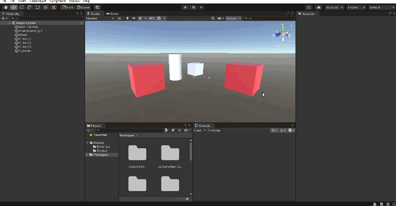
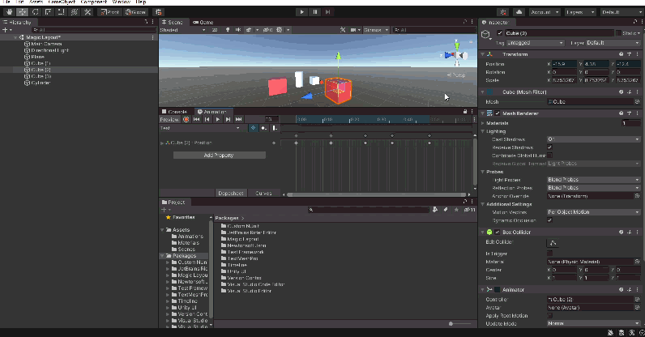
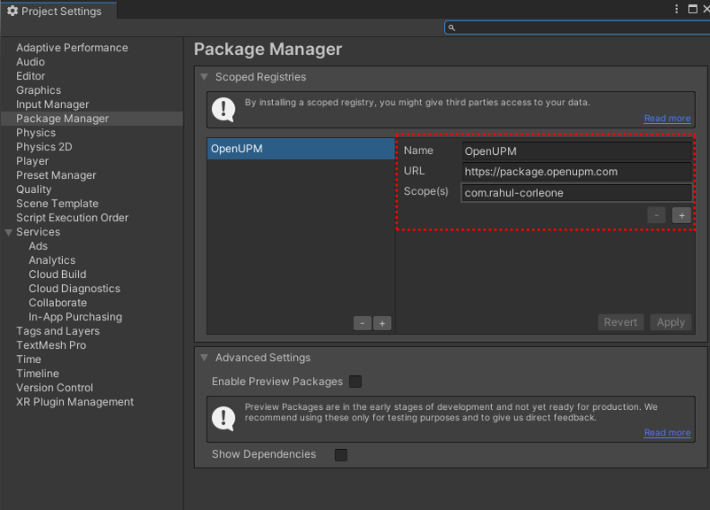
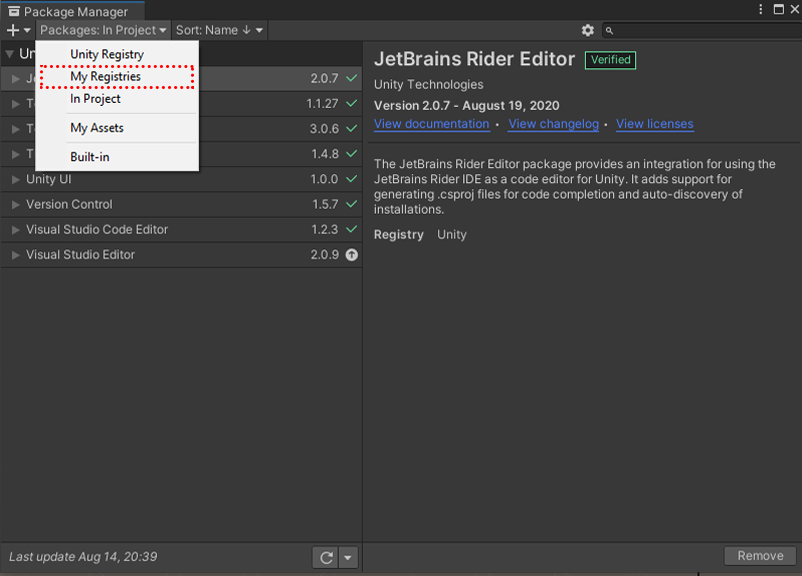
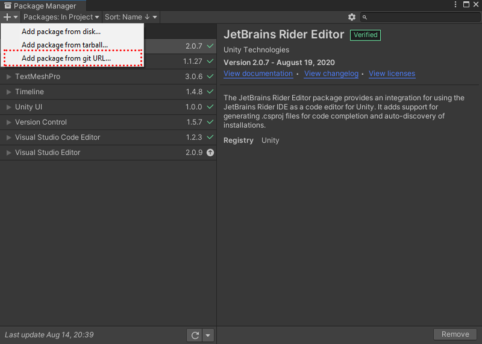

<p align="center"></p>

<h1 align="center">Magic Layout</h1>

<h3 align="center">Simple And Powerfull Layout Customization for Unity</h3>

<div align="center">
  <!-- License -->
  <a href="LICENSE">
    
  </a>

<!-- Issues -->

<a href="https://github.com/r4hulCorleone/unity-magic-layout/issues">
    
  </a>

<!-- Pull Requests -->

<a href="https://github.com/r4hulCorleone/unity-magic-layout/pulls">
    
  </a>

<!-- Open UPM -->
  <a href="https://openupm.com/packages/com.rahul-corleone.magic-layout/">
    
  </a>
  
<!-- Downloads total -->
<!-- <a href="https://github.com/r4hulCorleone/unity-magic-layout/releases">
    
  </a> -->

  
</div>

<div align="center">
  <h3>
    <a href="https://github.com/r4hulCorleone/unity-magic-layout#features">
      Features
    </a>
    <span> | </span>
    <a href="https://github.com/r4hulCorleone/unity-magic-layout#download-and-installation">
      Download
    </a>
    <span> | </span>
    <a href="https://github.com/r4hulCorleone/unity-magic-layout#contribution">
      Contribution
    </a>
  </h3>
</div>

## What is Magic Layout?

_Magic Layout_ is a custom unity editor tool that gives you more flexibility when you are working with unity editor layout.

## Features

- Powerfull & Easy to Use, Just install.
<!-- - No dependency. -->

## Examples
<p align="center">
  
  
</p>

## Known Issues
- This package is __not__ recommended for linux users due to unity editor problems on linux, see also [#5](/../../issues/5).

## Download and Installation
<details>
  <summary>✅ Using OpenUPM (<b>Recommended</b>)</summary> 
By using scoped registry, you will access to future updates and bug fixes through Package Manager.

To add *Magic Layout* to your project, In unity editor:

- open `Edit/Project Settings/Package Manager`
- add a new Scoped Registry:
```
Name:  OpenUPM
URL:   https://package.openupm.com/
Scope: com.rahul-corleone
```
- click <kbd>Save</kbd>
- open Package Manager
- select ``My Registries`` in dropdown top left
- select ``Magic Layout`` and click ``Install``

<p align="center">
  
  
</p>
  
</details>

<details>
<summary>🟨 Using GitHub URL</summary>

Note that you won't be able to receive updates through Package Manager this way, you'll have to update manually.

To add *Magic Layout* to your project, In unity editor:
- open Window > Package Manager
- click <kbd>+</kbd>
- select <kbd>Add from Git URL</kbd>
- paste `https://github.com/r4hulCorleone/unity-magic-layout.git`
- click <kbd>Add</kbd>
  
  <p align="center">
  
</p>
</details>


## Contribution

Want to contribute? I am happy to hear that! Magic Layout is great but it can be greater. Please make sure to read the [Contributing Guide](CONTRIBUTING.md) before making a pull request.

Want to add some features to Magic Layout? Refer to open issues.

## Contributors

Thank you to all the people who have already contributed to Magic Layout [[contributors](https://github.com/r4hulCorleone/unity-magic-layout/graphs/contributors)]

## License

[MIT](https://github.com/r4hulCorleone/unity-magic-layout/blob/develop/LICENSE)
